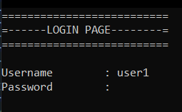
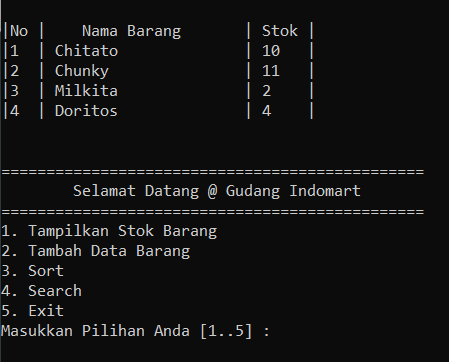
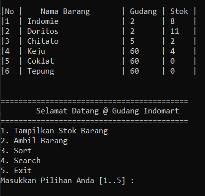

# Algorithm
This is my college final project on Algorithm &amp; Programming

## About the Program
This is a simple program where the user can check what items are still available in the warehouse and orders from each branch market from the warehouse

## What I've Learned
Using C language to implement search, sort, save, load, and login function

##Info
This program is using C and can be ran in any compilers that support C language, mine using Dev-C++

## Screenshot of Program
#### Login Screen

#### User1 Screen

#### User2 Screen

